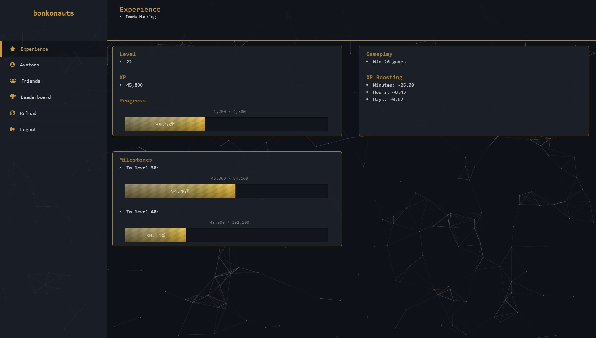
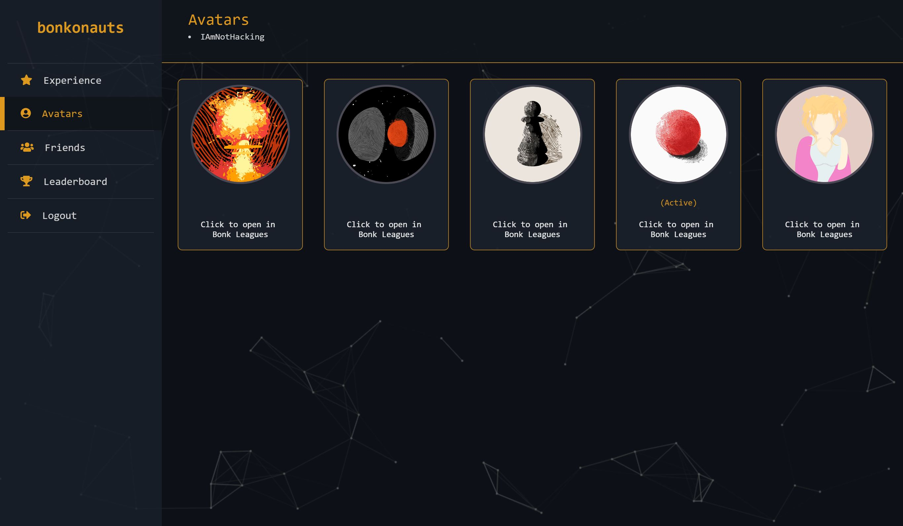
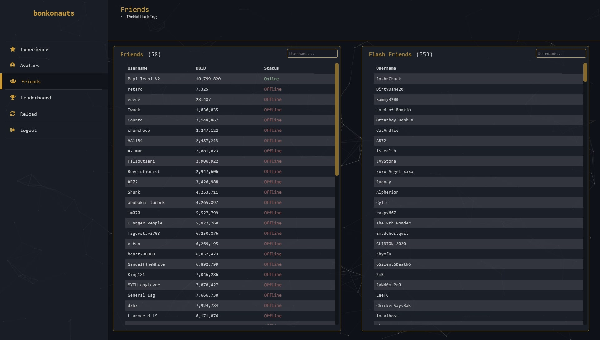
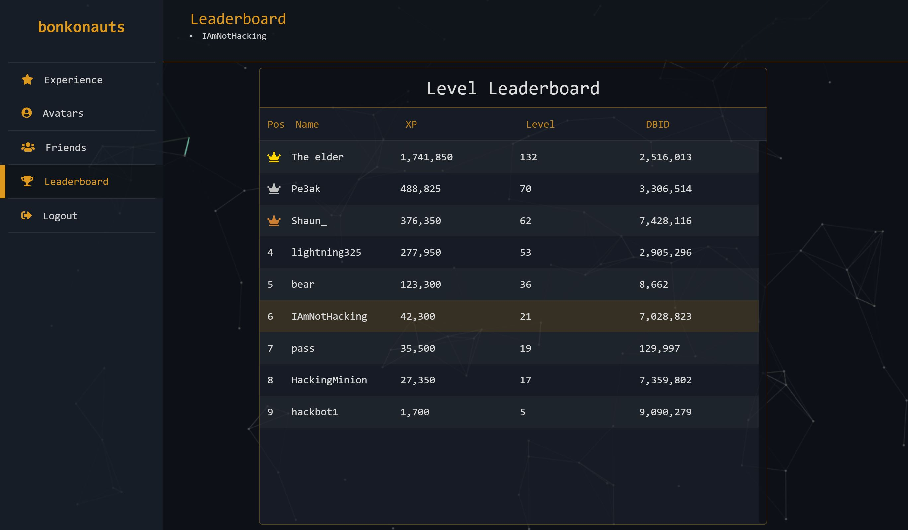

# bonkonauts

Hello! **bonkonauts** is a bonk.io account viewer / dashboard. By logging in with your account, you can see use and access some nice features, some of which are not included in bonk. 

`Note: The service is only available if you login with an account.`

## Pages / Features

### Experience
  - Data
    - Current Level
	- Current XP
	- Progress bar from your current XP to the next level.
  - Gameplay
    - The number of games you need to get to the next level.
	- If you have an XP script, the rough amount of time it will take to get to the next level.
  - Milestones
    - Displays two milestones. The milestone itself depends on your level.
	- If you are less than level 50, you get milestones of 10 levels
	- If you are less than level 100, you get milestones of 25 levels
	- If you are greater than level 100, you get milestones of 50 levels

### Avatars
  - Displays all 5 of your skin slots, as well as the option to open the skin in [Bonk Leagues](https://bonkleagues.io/) as a skin share link.

### Friends
  - Bonk Friends
    - Display a list of your bonk.io friends, their user id, and if they are online / offline.
  - Flash Friends
    - Simply display a list of all your friends from bonk.io flash version (if you had any)

### Leaderboard
  - The leaderboard is basically a list of every user that has logged in to **bonkonauts**, and is used more like a level leaderboard. It displays the highest level users at the top, and lowest level at the bottom. Anytime you login to **bonkonauts** or press the `Reload` button, the leaderboard will update accordingly.

## Contact
Keep in mind that everything on this site is subject to change, and all input is appreciated. If you have suggestions / new ideas / bug fixes, contact `IAmNotHacking#3249`
