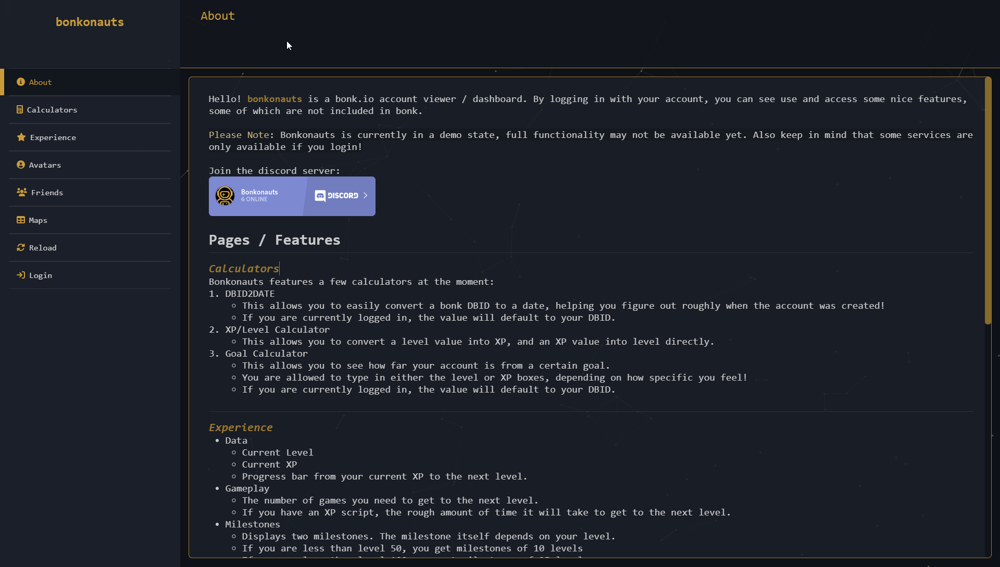
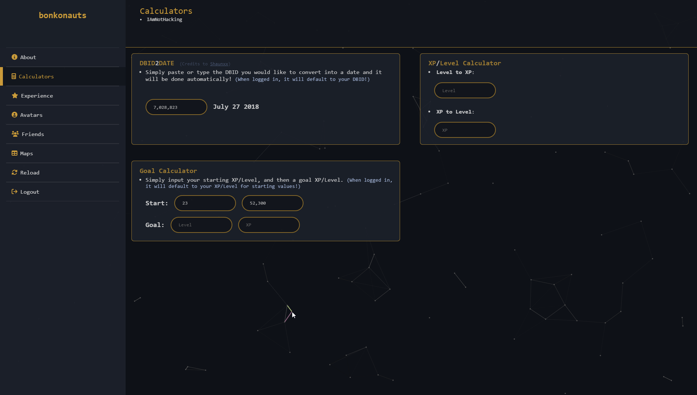
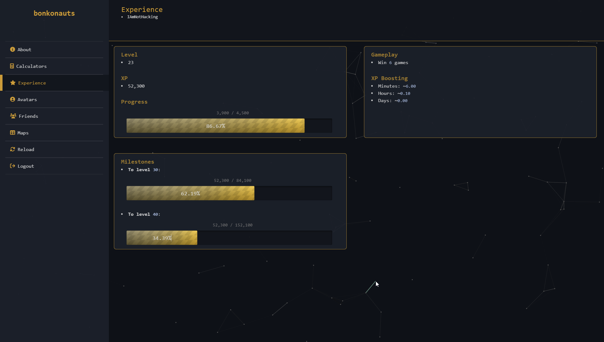
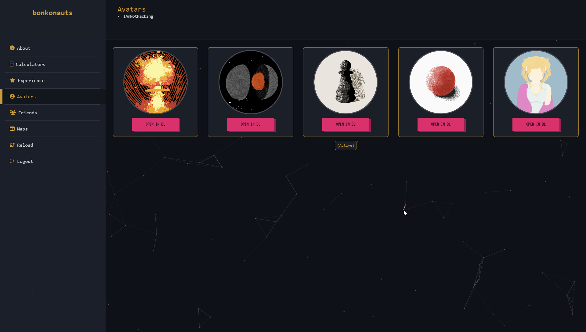
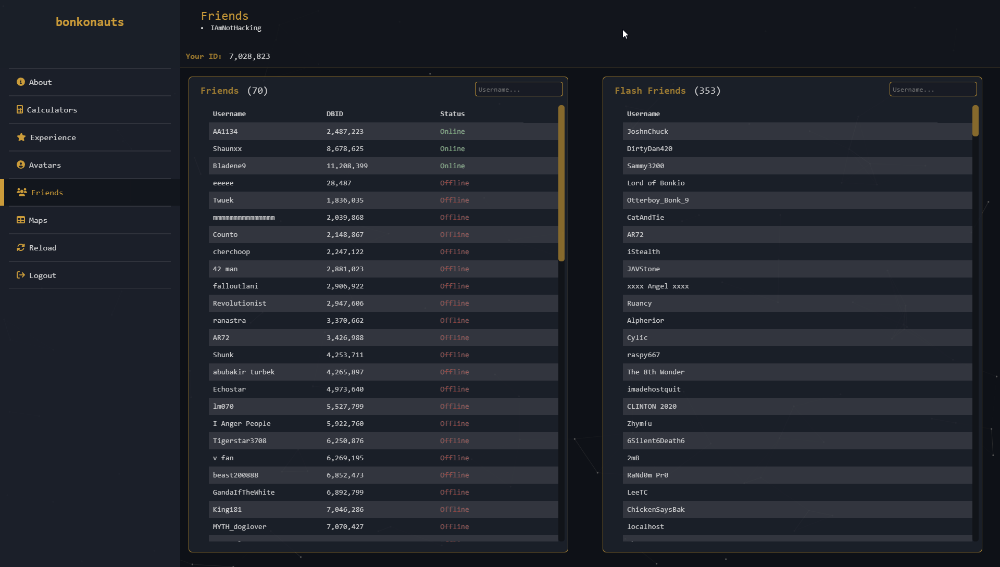
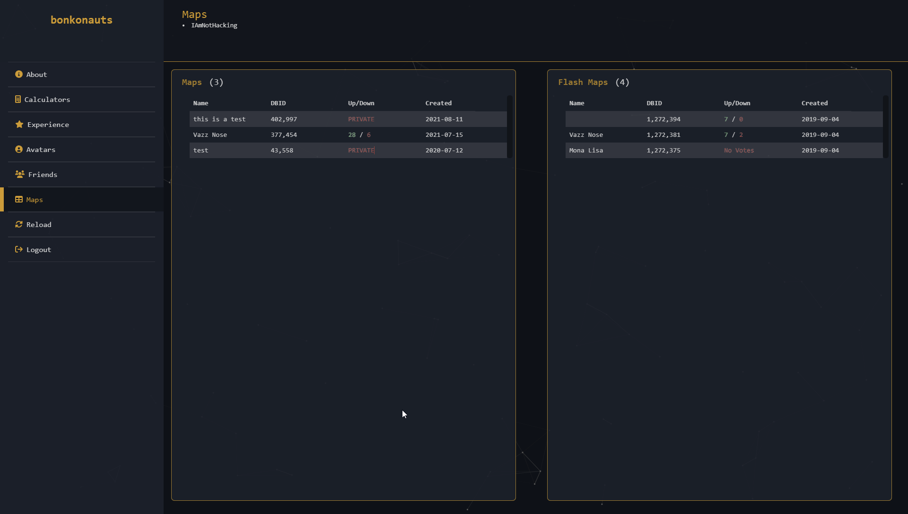

# **bonkonauts**

Hello! **bonkonauts** is a bonk.io account viewer / dashboard. By logging in with your account, you can see use and access some nice features, some of which are not included in bonk. 

`Please Note: Bonkonauts is currently in a demo state, full functionality may not be available yet.`

`Note: The service is only available if you login with an account.`

## **Pages / Features**
---
### **_About_**
  - The exact same information as here, but without screenshots...
  
---
### **_Calculators_**
Bonkonauts features a few calculators at the moment:
  1. DBID2DATE 
     * This allows you to easily convert a bonk DBID to a date, helping you figure out roughly when the account was created!
     * If you are currently logged in, the value will default to your DBID.
  2. XP/Level Calculator
     * This allows you to convert a level value into XP, and an XP value into level directly.
  3. Goal Calculator
     * This allows you to see how far your account is from a certain goal.
     * You are allowed to type in either the level or XP boxes, depending on how specific you feel!
     * If you are currently logged in, the value will default to your DBID.
  
---
### **_Experience_**
  - Data
    - Current Level
	- Current XP
	- Progress bar from your current XP to the next level.
  - Gameplay
    - The number of games you need to get to the next level.
	- If you have an XP script, the rough amount of time it will take to get to the next level.
  - Milestones
    - Displays two milestones. The milestone itself depends on your level.
	- If you are less than level 50, you get milestones of 10 levels
	- If you are less than level 100, you get milestones of 25 levels
	- If you are greater than level 100, you get milestones of 50 levels

---
### **_Avatars_**
  - Displays all 5 of your skin slots, as well as the option to open the skin in [Bonk Leagues](https://bonkleagues.io/) as a skin share link.

---
### **_Friends_**
  - Bonk Friends
    - Display a list of your bonk.io friends, their user id, and if they are online / offline.
  - Flash Friends
    - Simply display a list of all your friends from bonk.io flash version (if you had any)

---
---
### **_Maps_**
  - Maps
    - Display a list of your current bonk.io maps, their map id, how many votes (and if private) and when the map was created.
  - Flash Maps
    - Display a list of your flash bonk.io maps (if you had any), their map id, how many votes (and if private) and when the map was created.

---
### **_Leaderboard_**
  - The leaderboard is basically a list of every user that has logged in to **bonkonauts**, and is used more like a level leaderboard. It displays the highest level users at the top, and lowest level at the bottom. Anytime you login to **bonkonauts** or press the `Reload` button, the leaderboard will update accordingly.
  - As of right now, the leaderboard is currently deprecated due to lack of a server...
  - This screenshot is currently from an old build of **bonkonauts**.

---
## **Contact**
Keep in mind that everything on this site is subject to change, and all input is appreciated. If you have suggestions / new ideas / bug fixes, contact `IAmNotHacking#3249`
